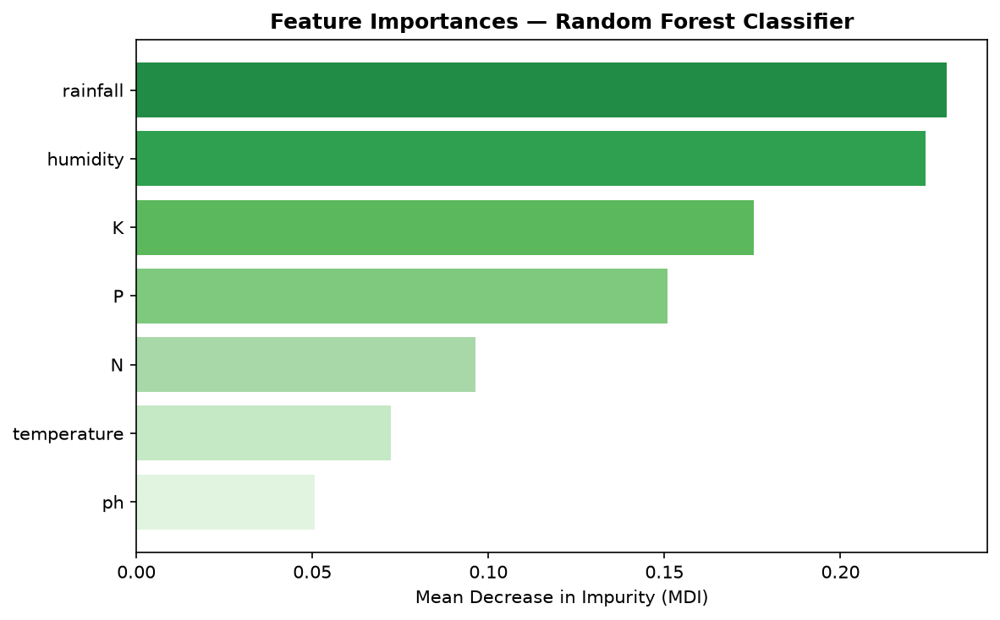
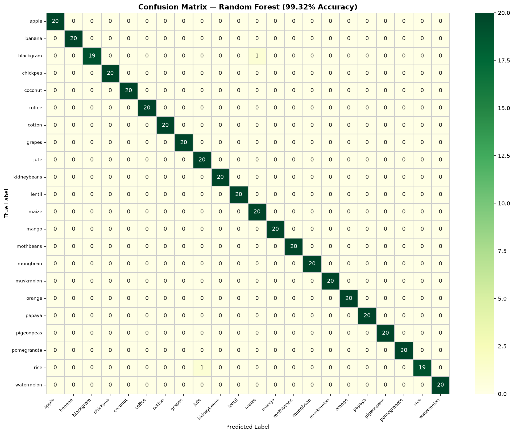
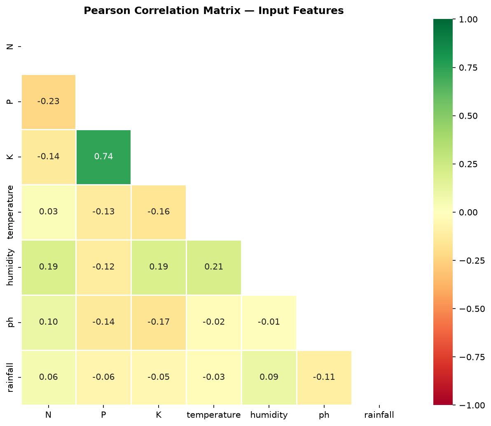
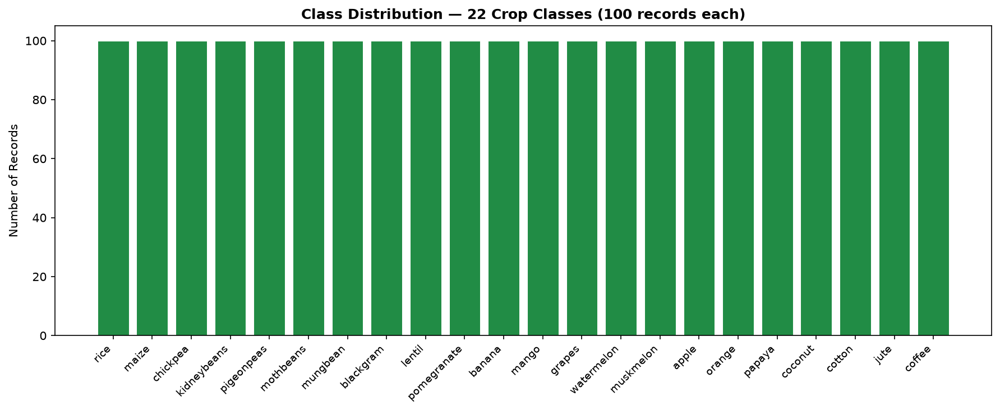

# 🌾 Smart Crop Recommendation System — AgroSmart AI

[](https://python.org)
[](https://streamlit.io)
[](https://scikit-learn.org)
[](#results)
[](LICENSE)

> **AgroSmart AI** is an intelligent agricultural decision-support system that recommends the most suitable crop for a given set of soil and climatic parameters using a high-precision Random Forest classifier trained on 2,200 agricultural records across 22 crop classes.

---

## 📸 Overview & Highlights

- 🎯 **99.32% Classification Accuracy** on 20% holdout test set (Stratified Split)
- 🧪 **7 Soil & Climate Inputs:** Nitrogen (N), Phosphorus (P), Potassium (K), Temperature, Humidity, pH, Rainfall
- 🌾 **22 Supported Crops:** Rice, Maize, Chickpea, Kidneybeans, Pigeonpeas, Mothbeans, Mungbean, Blackgram, Lentil, Pomegranate, Banana, Mango, Grapes, Watermelon, Muskmelon, Apple, Orange, Papaya, Coconut, Cotton, Jute, Coffee
- ⚡ **Interactive Streamlit Web Interface** with real-time prediction and top-3 probability confidence scores

---

## 🧠 Problem Statement

Agricultural productivity heavily depends on matching crops with appropriate soil chemistry and climatic factors. Traditional estimation and manual guesswork often lead to suboptimal crop yields, soil degradation, and economic loss. **AgroSmart AI** solves this by leveraging machine learning to provide data-driven, instantaneous recommendations.

---

## 📊 Dataset & Features

| Property | Value |
|---|---|
| Source | [Kaggle — Crop Recommendation Dataset](https://www.kaggle.com/datasets/atharvaingle/crop-recommendation-dataset) |
| Total Records | 2,200 |
| Features | 7 continuous numerical features |
| Classes | 22 crop categories (100 samples per class — perfectly balanced) |
| Missing Values | 0 |

### Input Features Description

| Feature | Description | Unit | Range in Dataset |
|---|---|---|---|
| **N** | Nitrogen content in soil | mg/kg (ratio) | 0 – 140 |
| **P** | Phosphorus content in soil | mg/kg (ratio) | 5 – 145 |
| **K** | Potassium content in soil | mg/kg (ratio) | 5 – 205 |
| **temperature** | Ambient temperature | °C | 8.8 – 43.7 °C |
| **humidity** | Relative humidity | % | 14.3 – 99.9 % |
| **ph** | Soil pH value | pH scale | 3.5 – 9.9 |
| **rainfall** | Average precipitation | mm | 20.2 – 298.6 mm |

---

## 🌲 Model Architecture & Selection

```
Random Forest Classifier
├── n_estimators  : 100 decision trees
├── criterion     : Gini Impurity
├── random_state  : 42
├── n_jobs        : -1 (multithreaded)
└── Validation    : 80:20 Stratified Train-Test Split
```

### Why Random Forest?
1. **Non-linear Boundary Handling:** Captures complex environmental interdependencies.
2. **Robustness to Noise:** Ensemble averaging prevents overfitting.
3. **Interpretability:** Built-in Mean Decrease in Impurity (MDI) feature importances.
4. **Scale-Invariant:** Does not require heavy feature scaling, retaining natural physical units.

---

## 📈 Results & Visualizations

| Evaluation Metric | Score |
|---|---|
| **Test Accuracy** | **99.32%** (437 / 440 correct) |
| **Macro Precision** | 0.9926 |
| **Macro Recall** | 0.9933 |
| **Macro F1-Score** | 0.9926 |

### Visual Analysis

| Feature Importance | Confusion Matrix |
|:---:|:---:|
|  |  |

| Correlation Heatmap | Class Distribution |
|:---:|:---:|
|  |  |

---

## 🗂️ Project Structure

```
AgroSmartAI/
├── app.py                      # Interactive Streamlit Web Application
├── train_model.py              # End-to-end model training & evaluation script
├── Crop_recommendation.csv     # Dataset (2,200 records)
├── requirements.txt            # Python library dependencies
├── LICENSE                     # MIT License
├── README.md                   # Comprehensive project documentation
│
├── model/
│   └── crop_model.pkl          # Serialized Random Forest model artifact
│
├── assets/
│   ├── class_distribution.png  # Class balance chart
│   ├── confusion_matrix.png    # Evaluation confusion matrix heatmap
│   ├── correlation_heatmap.png # Feature correlation matrix
│   └── feature_importance.png  # Feature importance rankings
│
└── notebooks/
    ├── README.md
    └── Crop_Recommendation_EDA_and_Modeling.ipynb # Exploratory Analysis & Experiments
```

---

## 🚀 Getting Started

### 1. Clone the Repository
```bash
git clone https://github.com/sanjanasingh97721-hash/AgroSmartAI.git
cd AgroSmartAI
```

### 2. Create and Activate Virtual Environment (Optional but Recommended)
```bash
python -m venv venv
# On Windows:
venv\Scripts\activate
# On Linux/macOS:
source venv/bin/activate
```

### 3. Install Dependencies
```bash
pip install -r requirements.txt
```

### 4. Run the Streamlit Application
```bash
streamlit run app.py
```
Open your browser at `http://localhost:8501`.

### 5. Re-train the Model (Optional)
```bash
python train_model.py
```

---

## 🛠️ Tech Stack

- **Core:** Python 3.10+
- **Machine Learning:** scikit-learn, NumPy, pandas
- **Data Visualization:** Matplotlib, Seaborn
- **Web Framework:** Streamlit
- **Model Serialization:** Pickle

---

## 📄 License

This project is licensed under the [MIT License](LICENSE).

---

## 👤 Author

**Sanjana Singh**  
- **GitHub:** [@sanjanasingh97721-hash](https://github.com/sanjanasingh97721-hash)  
- **Focus:** Data Science & Machine Learning
